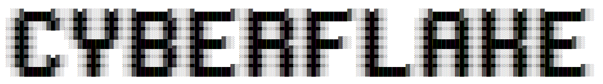

<h1>Hello Techie !!</h1>

Welcome to Cyberflake's GitHub repository your comprehensive guide to the world of Linux, AWS, Ubuntu, Redhat, DevOps, Nginx and other server administration services we are a community of Freelancers, System Administrators, Tech Enthusiasts and Noobs who share their passion for technology through insightful and informative code contributions here you'll find a collection of scripts configurations and projects designed to simplify and enhance your server administration tasks feel free to explore contribute and collaborate with us on our journey to make technology more accessible and efficient for everyone.
  
<h2>Connect Us</h2>

<table>
  <tr>
    <td></td>
    <th>Platform</th>
    <th>Content Types</th>
  </tr>
  <tr>
    <td>  </td>
    <td><a target="_blank" href="https://cyberflake.net/">Website</a></td>
    <td>Blogs</td>
  </tr>
  <tr>
    <td>  </td>
    <td> <a target="_blank" href="https://www.instagram.com/cyberflakeconnect/"> Instagram</td>
    <td>Memes</td>
  </tr>
  <tr>
    <td>  </td>
    <td><a target="_blank" href="https://github.com/cyberflakeconnect">Github</a></td>
    <td>Code Snippet</td>
  </tr>
  <tr>
    <td>  </td>
    <td><a target="_blank" href="https://www.youtube.com/@cyberflakeconnect">YouTube</td>
    <td>Shorts</td>
  </tr>
</table>
